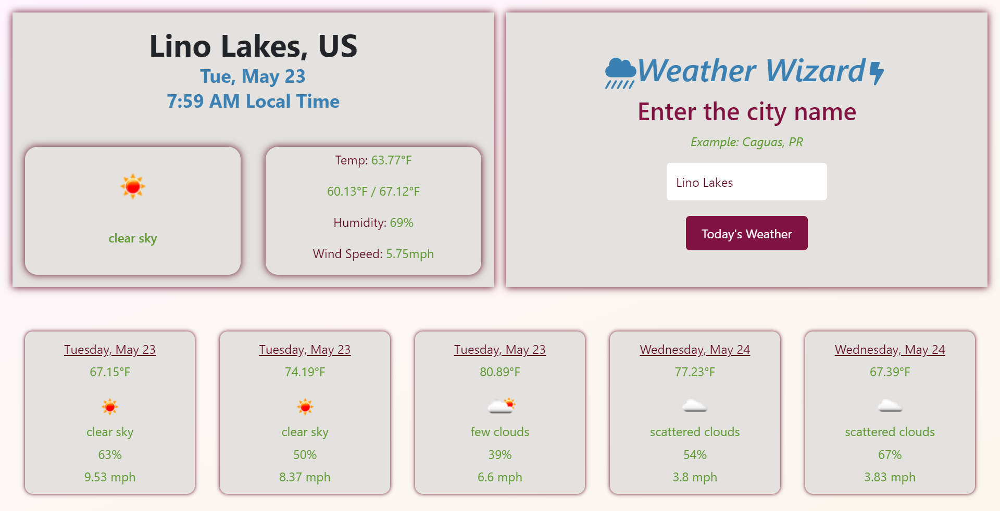

# Weather Wizard

## Table of Contents
- [License](#license)
- [Description](#description)
- [Motivation](#motivation)
- [Technologies](#technologies)
- [Features](#features)
- [Deployment](#Deployment)
- [Testing](#testing)

## License
This project is licensed under the MIT license.

## Description
An advanced weather dashboard that displays the current weather, the 5 day forecast, the local time of any city, and saves their home city for better user experience. 

## Motivation
I challenged myself to create a superior Weather Dashboard beyond the scope of the Minnesota Coding Bootcamp requirements. My original dashboard had several limitations, and I believed that additional features would enhance its functionality. As a result, I expanded upon the existing design to create a more comprehensive and user-friendly interface.

## Technologies
OpenWeather API:
The OpenWeather API is a web-based service that provides weather data and forecasts for various locations around the world. It allows developers to access real-time and historical weather data in a programmatic way, using HTTP requests to retrieve JSON or XML responses. The API provides a wide range of weather data, including temperature, humidity, wind speed and direction, precipitation, and more. It also includes features such as historical data retrieval, weather alerts, and UV index forecasts. 

TimeZoneDB API:
TimeZone BD is a web service that provides time zone data and related services, such as current time, time zone conversion, and daylight saving time information. It allows developers to integrate time zone functionality into their applications, such as scheduling, appointment booking, and time-based notifications. 

## Features
The user can enter any city across the globe and see the local time, the current weather (including the temperature, skies, humidity, low / high, wind speed ), along with the next 5 day forecast. The , which allows the dashboard to immediately fetch the default location when they visit the app, instead of manually entering their city each time they visit. 

This color scheme passes the AA and AAA level of the WCAG guidelines.

## Deployment
Due to this portfolio being a SPA, I have decided to simply use GitPages for the deployment. Check it out [here](https://kenny4297.github.io/Weather-Wizard/)!

## Testing
I used Jest and RTL for tests. Here is the coverage table for all tests:

----------------------|---------|----------|---------|---------|-------------------
File                  | % Stmts | % Branch | % Funcs | % Lines | Uncovered Line #s 
----------------------|---------|----------|---------|---------|-------------------
All files             |   76.85 |    57.77 |   77.77 |   80.89 |                   
 src                  |   26.66 |    35.71 |      25 |   26.66 |                   
  App.tsx             |     100 |       50 |      50 |     100 | 26-34             
  index.js            |       0 |      100 |     100 |       0 | 8-16              
  reportWebVitals.js  |       0 |        0 |       0 |       0 | 1-8               
 src/components       |   84.94 |    67.74 |   92.85 |   84.94 |                   
  DisplayForecast.tsx |   65.51 |    54.54 |      80 |   65.51 | 62-69,110,180-181 
  DisplayWeather.tsx  |   97.05 |       80 |     100 |   97.05 | 100               
  IntroPage.tsx       |      90 |       70 |     100 |      90 | 24,34,43          
  index.ts            |       0 |        0 |       0 |       0 |                   
----------------------|---------|----------|---------|---------|-------------------

If you have any suggestions for improvement, please feel free to share them with me! Thanks for viewing this README!

